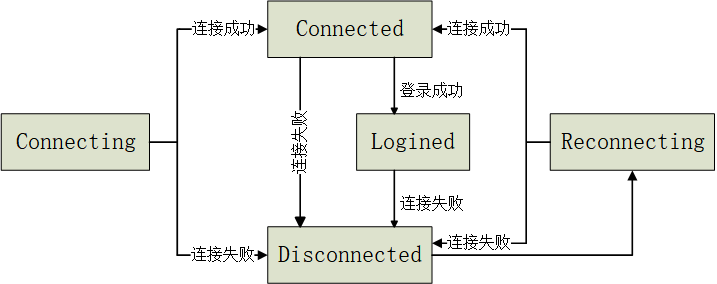

## 信令服务器协议

### 服务地址
* 房间管理等业务服务采用HTTP协议，地址为：http://IP:PORT
* Peer To Peer的媒体协商、网络协商等服务采用WebSocket协议，地址为：ws://IP:PORT/signaling

### 通信协议
#### >>> 房间管理
1. 查询某个房间的信息
```
接口地址：.../room/<roomid>
请求方式：GET
请求参数：无
返回结果：
{
    "status": 0,
    "message": "OK",
    "data": {
        "roomid": "xxx",
        "room_type": 0,
        "sessionids": [0, 1],
        "broadcaster_sessionid": 0
    }
}
```

2. 查询所有房间的信息
```
接口地址：.../rooms
请求方式：GET
请求参数：无
返回结果：
{
    "status": 0,
    "message": "OK",
    "data": {
        "xxx": 
        {
            "roomid": "xxx",
            "room_type": 0,
            "sessionids": [0, 1],
            "broadcaster_sessionid": 0
        },
        "yyy": 
        {
            "roomid": "yyy",
            "room_type": 1,
            "sessionids": [0, 1],
            "broadcaster_sessionid": -1
        }
    }
}
```

3. 打开房间
```
接口地址：.../room/open
请求方式：POST
请求参数：
{
    "sessionid": 0,
    "roomid": "xxx",
    "room_type": 0
    "force": 0
}
返回结果：
{
    "status": 0,
    "message": "OK"
}
```

```
WebSocket服务端给所有连接的客户端发送：
{
    "command": "take_roominfo",
    "type": "new",
    "roomid": "xxx"
}
```

4. 加入房间
```
接口地址：.../room/join
请求方式：POST
请求参数：
{
    "sessionid": 0,
    "roomid": "xxx"
}
返回结果：
{
    "status": 0,
    "message": "OK",
    "data": {
        "roomid": "xxx",
        "room_type": 0,
        "sessionids": [0, 1],
        "broadcaster_sessionid": 0
    }
}
```

5. 离开房间
```
接口地址：.../room/leave
请求方式：POST
请求参数：
{
    "sessionid": 0
}
返回结果：
{
    "status": 0,
    "message": "OK"
}
```
               
```
如果房间创建者离开房间或者房间中所有人都离开，则WebSocket服务端给所有连接的客户端发送：
{
    "command": "take_roominfo",
    "type": "delete",
    "roomid": "xxx"
}
```

#### >>> P2P管理
1. RtcAgent通过WebSocket连接到信令服务器，将生成SessionId，服务端将登录成功信息返回给RtcAgent
```
{
    "command": "take_info",
    "type": "login_succeed",
    "sessionid": 0
}
```

2. Peer端主动发送SDP offer
```
{
    "command": "take_configuration",
    "type": "offer",
    "sdp": "xxx",
    "from": 0,
    "to": 1,
    "roomid": "xxx"
}
```

3. 信令服务器转发SDP offer
```
{
    "command": "take_configuration",
    "type": "forward_offer",
    "sdp": "xxx",
    "from": 0,
    "to": 1,
    "roomid": "xxx"
}
```

4. Peer端收到信令服务器转发的SDP offer，则发送SDP answer
```
{
    "command": "take_configuration",
    "type": "answer",
    "sdp": "xxx",
    "from": 0,
    "to": 1,
    "roomid": "xxx"
}
```

5. 信令服务器转发SDP answer
```
{
    "command": "take_configuration",
    "type": "forward_answer",
    "sdp": "xxx",
    "from": 0,
    "to": 1,
    "roomid": "xxx"
}
```

6. Peer端发送candidate到信令服务器
```
{
    "command": "take_candidate",
    "candidate": "xxx",
    "sdp_mid": "xxx",
    "sdp_mline_index": 0,
    "from": 0,
    "to": 1
}
```

7. 信令服务器直接转发candidate

#### >>> WebSocket长连接心跳管理
1. 客户端每隔一段时间发送PING心跳包
```
{
    "command": "take_heartbeat",
    "type": "ping"
}
```

2. 服务端收到客户端心跳包，立即返回PONG心跳包
```
{
    "command": "take_heartbeat",
    "type": "pong"
}
```

#### >>> 事件通知管理
##### WebSocket房间通知
1. 正常打开房间，信令服务器会通知本端和所有连接的客户端
2. 与信令服务器断开，如果本端是房间创建者，则信令服务器会删除该房间，并通知所有连接的客户端（当然是不包括本端）
3. 调用RtcLeaveRoom或者本端程序退出，则与2处理方式相同

##### WebSocket用户通知
TO DO

##### P2P状态通知
1. 与信令服务器断开，本端会清空所有远端连接，本端不会收到P2P连接断开的通知，对端会收到
2. 调用RtcLeaveRoom或者本端程序退出，则与1处理方式相同
3. P2P正常断开，本端和远端都会收到P2P连接断开通知
4. P2P建立过程出现问题（比如：AckRemotePeerSdp方法出现问题），RTC SDK内部逻辑问题，无能为力

##### DataChannel状态通知
与P2P状态通知一致

##### 与信令服务器状态通知


1. 连接失败的原因：网络问题、对端关闭、心跳检测超时
2. 如果一直重连，仅发送一次Disconnected状态和Reconnecting状态
3. 连接失败时，本端会断开与所有远端的P2P连接。注意：
    1. 如果本端是房间创建者，信令服务器会删除该房间，并通知所有其他端房间通知
    2. 本端不会收到P2P状态和DataChannel状态通知
    3. 远端会收到P2P状态和DataChannel状态通知

##### 以车云通信为例，事件通知使用
1. 云端（打开房间端）
    1. 注册ServerConnectionStateHandler回调函数，当状态为ServerLogined时，依次调用RtcLeaveRoom和RtcOpenRoom方法
    2. 注册DataChannelStateHandler回调函数，当状态为DataChannelOpen时，调用RtcSendData方法发送逻辑数据

2. 车端（加入房间端）
   1. 注册ServerConnectionStateHandler回调函数，当状态为ServerLogined时，则先退出房间再加入房间
   2. 注册DataChannelStateHandler回调函数，当状态为DataChannelOpen时，可以开始发送数据
   3. 注册P2PStateHandler回调函数，当状态为P2PDisconnected时，则先退出房间再加入房间
   4. 注册RoomHandler回调函数，订阅感兴趣的房间事件通知，可以避免使用RtcQueryRooms方法频繁查询房间